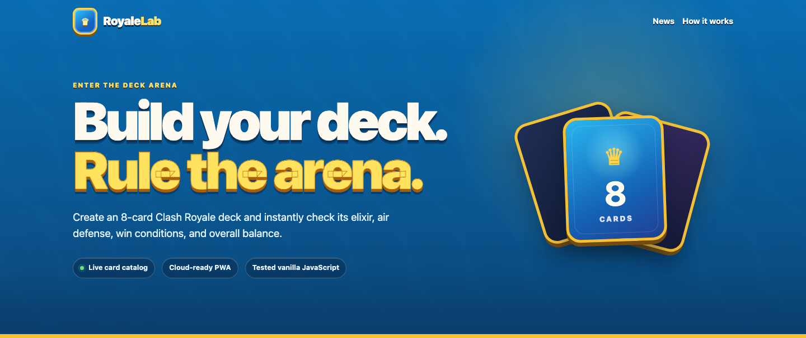
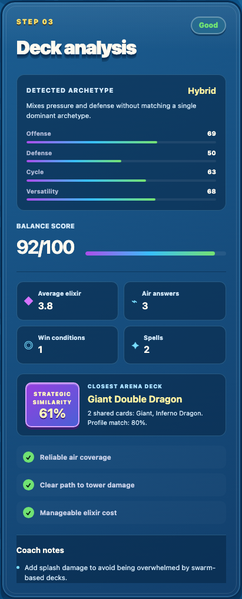
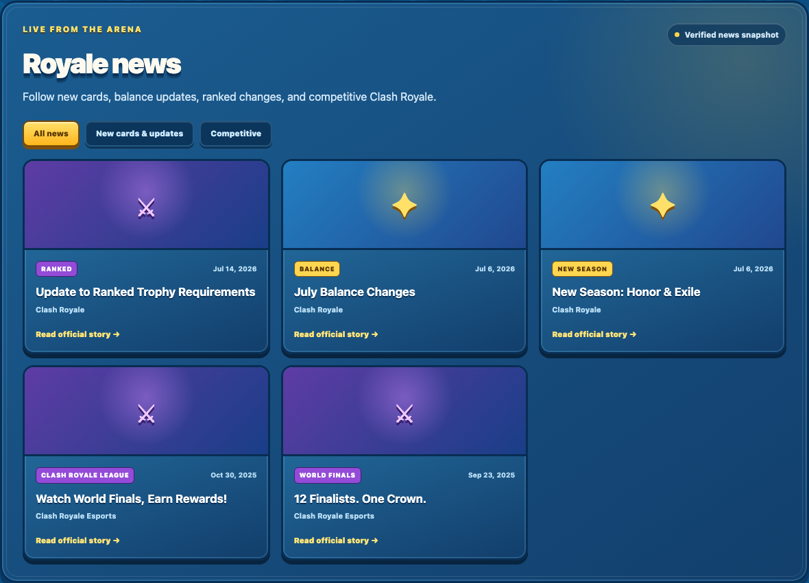
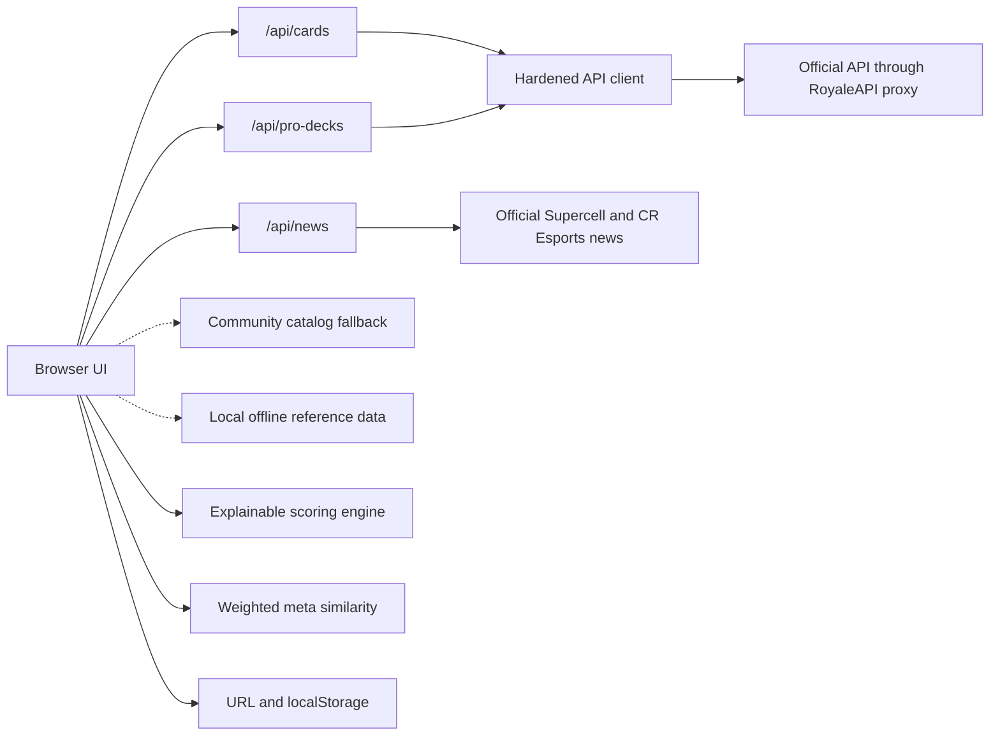

# Royale Deck Analyzer

[](https://github.com/maxhrdz/ClashDeck/actions/workflows/ci.yml)
[](https://developer.mozilla.org/docs/Web/JavaScript)
[](https://playwright.dev/)
[](https://web.dev/explore/progressive-web-apps)
[](https://clash-deck-dun.vercel.app/)

A cloud-ready, installable Clash Royale deck intelligence tool built with HTML, CSS, and modular vanilla JavaScript. Build an eight-card deck to receive an explainable balance score, archetype detection, role coverage, profile metrics, and actionable recommendations.

**Live application:** [clash-deck-dun.vercel.app](https://clash-deck-dun.vercel.app/)



## Contents

- [Why this project stands out](#why-this-project-stands-out)
- [Product screenshots](#product-screenshots)
- [Features](#features)
- [Architecture](#architecture)
- [Data sources](#data-sources)
- [Getting started](#getting-started)
- [Testing](#testing)
- [Deployment](#deployment)
- [Engineering trade-offs](#engineering-trade-offs)

## Why this project stands out

- **Explainable analysis:** every score is produced by transparent deck-building rules.
- **Resilient data layer:** official API, community catalog, and offline fallback.
- **Security-aware architecture:** the official token is isolated in a serverless function.
- **Shareable state:** complete decks can be encoded in portable URLs.
- **Progressive Web App:** installable shell with offline application assets.
- **Quality gates:** zero-dependency unit tests and GitHub Actions CI.
- **Meta comparison engine:** weighted similarity across card overlap, deck profile, and elixir curve.
- **End-to-end confidence:** Playwright runs the full deck-building flow on desktop and mobile.
- **Production hardening:** timeouts, typed upstream errors, health checks, caching, and security headers.
- **Official news aggregation:** cached Clash Royale update and competitive stories with verified fallbacks.
- **Accessible UI:** semantic controls, live regions, keyboard focus, and reduced-motion support.

## Product screenshots

### Explainable deck report

The report combines a deterministic balance score, archetype detection, four strategic metrics, role checks, coach notes, and similarity against an arena reference deck.

<p align="center">
  
</p>

### Official news dashboard

The news aggregator separates new-card and game updates from ranked and competitive stories, while clearly indicating whether the data is live or a verified snapshot.



## Features

- Loads current card data from the official Clash Royale API when configured
- Searches and filters the complete catalog by card type
- Builds, saves, restores, and shares eight-card decks
- Detects Cycle, Control, Beatdown, Siege, Spell Bait, and Hybrid archetypes
- Measures offense, defense, cycle speed, and versatility
- Calculates average elixir and card-role coverage
- Detects win conditions, air defense, splash damage, and tank killers
- Rates decks as Good, Regular, or Weak
- Generates recommendations from missing roles and structural problems
- Provides responsive desktop, tablet, and mobile layouts
- Compares a deck against live top-ladder decks or clearly labeled reference archetypes
- Loads a reference deck into the analyzer with one click
- Filters official news into new-card/game updates and competitive Clash Royale

## Architecture



The analyzer and meta comparison engine are intentionally isolated from the DOM. This makes their rules deterministic and directly testable. The serverless API client centralizes authentication, timeouts, error mapping, and upstream request behavior.

### Responsibilities

| Layer | Responsibility |
| --- | --- |
| `app.js` | UI state, rendering, events, and accessibility updates |
| `analyzer.js` | Pure scoring, role counts, archetypes, metrics, and recommendations |
| `meta-analysis.js` | Weighted comparison against live or reference decks |
| `api.js` / `news.js` | Browser data normalization and fallback orchestration |
| `api/*.js` | Serverless secret isolation, upstream requests, caching, and error mapping |
| `deck-storage.js` | Local persistence and portable URL serialization |
| `service-worker.js` | Versioned offline application shell |

### Meta similarity model

The closest reference deck is selected with a transparent weighted score:

- 40% exact card overlap
- 45% similarity across offense, defense, cycle, and versatility
- 15% average-elixir proximity

This is a heuristic rather than a win-rate prediction. The UI exposes the closest deck, shared cards, and profile similarity so the result can be inspected instead of treated as a black box.

## Data sources

The app uses a three-level strategy:

1. `/api/cards` requests the official Supercell cards endpoint through a secure serverless function.
2. `/api/pro-decks` combines global rankings with recent public battle logs to extract current top-ladder decks.
3. If card data is unavailable, the browser requests RoyaleAPI's public [`cards.json`](https://royaleapi.github.io/cr-api-data/json/cards.json) catalog.
4. If live deck data is unavailable, labeled reference archetypes keep the comparison experience usable without pretending to be current rankings.

News uses `/api/news`, which refreshes the public official Clash Royale archive hourly and merges verified official competitive links. If the source is temporarily unavailable, the UI identifies its local data as a verified snapshot rather than live news.

Official card artwork is used when supplied by the API, with the RoyaleAPI CDN as a fallback.

## Getting started

### Requirements

- Node.js 20 or newer
- npm
- Python 3 for the simplest static development server, or Vercel CLI for serverless endpoints

### Installation

```bash
npm install
npm run ci
python3 -m http.server 8080
```

Open [http://localhost:8080](http://localhost:8080).

The Python server demonstrates the complete interface with community and verified local fallbacks. To execute `/api/cards`, `/api/pro-decks`, `/api/news`, and `/api/health` locally, configure the environment variable and use `vercel dev`.

### Environment variables

| Variable | Required | Purpose |
| --- | --- | --- |
| `CLASH_ROYALE_API_TOKEN` | Production data only | Authenticates server-side requests to the official Clash Royale API |

Copy `.env.example` to `.env.local` and replace its placeholder. Never expose this token in browser JavaScript or commit it to Git.

### Available commands

| Command | Description |
| --- | --- |
| `npm run check` | Validates JavaScript syntax across browser, API, and configuration files |
| `npm test` | Runs deterministic unit and integration tests |
| `npm run test:e2e` | Runs complete desktop and mobile flows in Chromium |
| `npm run ci` | Runs the local CI quality gate |
| `npm run screenshots` | Regenerates the README screenshots from the local application |

## Testing

```bash
npm test
npm run test:e2e
```

The current suite contains **19 unit/integration tests** and **6 end-to-end browser scenarios** across desktop and mobile Chromium. It covers:

- Deck-size validation
- Score and metric calculation
- Cycle, Beatdown, Siege, and Spell Bait detection
- Missing-role recommendations
- Official API response normalization
- Shareable deck URL parsing and serialization
- Weighted meta-deck comparison
- Authentication-header isolation and upstream error mapping
- Complete deck loading and analysis in desktop and mobile Chromium
- Regression coverage for the Step 3 incomplete-state bug
- Official-news parsing, validation, category filters, and fallback behavior

GitHub Actions installs Chromium, runs both suites on every pull request, and uploads the Playwright report when a browser scenario fails.

## API endpoints

| Endpoint | Source | Cache policy | Fallback behavior |
| --- | --- | --- | --- |
| `/api/cards` | Official Clash Royale cards | 1 hour | Community JSON, then local catalog |
| `/api/pro-decks` | Global rankings and public battle logs | 30 minutes | Labeled reference archetypes |
| `/api/news` | Official Clash Royale news archive | 1 hour | Verified news snapshot |
| `/api/health` | Application configuration | No store | Reports configuration without revealing secrets |

## Deployment

### Vercel with official data

1. Create a key at [developer.clashroyale.com](https://developer.clashroyale.com).
2. Whitelist the RoyaleAPI proxy IP `45.79.218.79` for serverless hosting.
3. Import this repository into Vercel.
4. Add `CLASH_ROYALE_API_TOKEN` in **Project Settings → Environment Variables**.
5. Deploy. Card data is cached for one hour and top-ladder decks for 30 minutes.
6. Verify `/api/health` reports `apiConfigured: true` without exposing the token.

Never commit the token or place it in browser JavaScript. A template is provided in `.env.example`.

### Post-deployment checklist

- Confirm `/api/health` returns `status: "ok"` and `apiConfigured: true`.
- Confirm the card status says `Official API`.
- Confirm the deck gallery says `Live top ladder decks`.
- Confirm the news section says `Official news · refreshed hourly`.
- Open a shared deck URL in a private window.
- Run the public URL through desktop and mobile responsive checks.

## Project structure

```text
.
├── .github/workflows/ci.yml
├── api/cards.js
├── api/pro-decks.js
├── api/health.js
├── api/news.js
├── assets/icons/icon.svg
├── assets/screenshots/
├── css/styles.css
├── js/
│   ├── analyzer.js
│   ├── api.js
│   ├── app.js
│   ├── config.js
│   ├── deck-storage.js
│   ├── meta-analysis.js
│   ├── news.js
│   └── pro-decks.js
├── tests/
├── scripts/capture-screenshots.mjs
├── playwright.config.js
├── index.html
├── manifest.webmanifest
├── service-worker.js
└── vercel.json
```

## Engineering trade-offs

- **Vanilla JavaScript:** keeps the runtime small and makes state management visible, at the cost of more manual DOM coordination.
- **Serverless proxy:** protects the API token and works with dynamic hosting, while upstream limits still require caching and graceful degradation.
- **Heuristic analysis:** produces explainable recommendations with no training data; it intentionally does not claim to predict match outcomes.
- **Layered fallbacks:** maximize availability, while the UI labels live and reference data differently to preserve data honesty.

## Disclaimer

This is an unofficial fan project. It is not affiliated with, endorsed, sponsored, or specifically approved by Supercell. Clash Royale and its assets are trademarks of Supercell.
